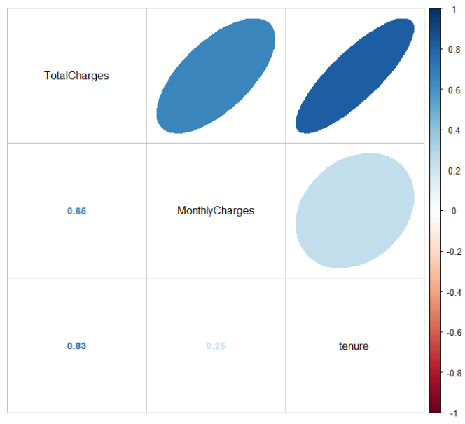
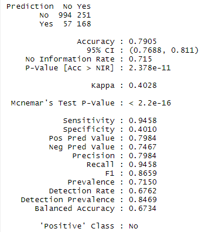

# Customer-churn-classification-using-R


## Overview
Customer churn rate is an important performance metric in the Telecoms industry
due to the highly competitive markets. The churn rate enables 
companies to understand why their customers are leaving. You 
are hereby provided with the churn dataset containing randomly collected 
data from a telecom company’s database. Develop ML models that can help 
the retention team predict high-risk churn customers before they leave

[//]: # (## Table of Contents)

[//]: # (- [Usage]&#40;#Usage&#41;)

[//]: # (  - [Install]&#40;#Install&#41;)

[//]: # (  - [Import the project file]&#40;#Import-the-project-file&#41;)

[//]: # (  - [Train on the environment]&#40;#Train-on-the-environment&#41;)

[//]: # (  - [Train and Evaluate]&#40;#Train-and-Evaluate&#41;)

[//]: # (    - [Train and Evaluate on the Taxi-v3 environment]&#40;#Train-and-Evaluate-on-the-Taxi-v3-environment&#41;)

[//]: # (    - [Train and Evaluate on the FrozenLake-v1 environment]&#40;#Train-and-Evaluate-on-the-FrozenLake-v1-environment&#41;)

[//]: # (  - [Tuning the Parameters using Decay Over Episodes Technique]&#40;#Tuning-the-Parameters-using-Decay-Over-Episodes-Technique&#41;)

[//]: # (    - [Tuning on the Taxi-v3 environment]&#40;#Tuning-on-the-Taxi-v3-environment&#41;)

[//]: # (    - [Tuning on the FrozenLake-v1 environment]&#40;#Tuning-on-the-FrozenLake-v1-environment&#41;)

[//]: # (  - [Use the Grid Search]&#40;#Use-the-Grid-Search&#41;)

[//]: # (    - [On the Taxi-v3 environment]&#40;#On-the-Taxi-v3-environment&#41;)

[//]: # (    - [On the FrozenLake-v1 environment]&#40;#On-the-FrozenLake-v1-environment&#41;)


## Project structure
### All the required library
```{r}
# install packages just of the first run
set.seed(42)

install.packages("caret")
install.packages("e1071")
install.packages("dplyr")
install.packages("tidyr")
install.packages("readr")
install.packages("corrplot")
install.packages("ggplot2")
install.packages("MASS")
install.packages("rms")
install.packages("ggpubr")
install.packages("gplots")
# Random Forest
install.packages("randomForest")

# Decision tree
install.packages("rpart")
install.packages("rpart.plot")

# Xgboost
install.packages("xgboost")

# Neural Network
install.packages("tensorflow")
install_tensorflow()
install.packages('reticulate')
install.packages('keras')

#ROC curve
install.packages("ROCR")
install.packages("pROC")
```
```{r}
library(dplyr)
library(caret)
library(e1071)
library(dplyr)
library(tidyr)
library(tidyverse)
library(readr)
library(corrplot)
library(ggplot2)
library(MASS)
library(rms)
library(ggpubr)
library(gplots)
library(reshape2)
library(plyr)
library(scales)

# Random Forest
library(randomForest)

# Decision tree
library(rpart)
library(rpart.plot)

# Xgboost
library(xgboost)

# Neural Network
library('tensorflow')
library(reticulate)
library(keras)

#ROC curve
library(ROCR)
library(pROC)
```

```{r}
# Load Our data
churn.data <- read.csv("Churn Dataset.csv", na.strings= '')
churn.data
```

### Check the correlation

> #### The scatterplot matrix
> ```{r}
> Filter(is.numeric, na.exclude(distinct(churn.data))) %>%
>   dplyr::select (TotalCharges, MonthlyCharges, tenure) %>%
>   plot()
> ```
> 
> 
> #### The correlation matrix
> ```{r}
> Filter(is.numeric, na.exclude(distinct(churn.data))) %>%
>   dplyr::select (TotalCharges, MonthlyCharges, tenure) %>%
>   cor() %>%
>   corrplot.mixed(upper = "ellipse", tl.col = "black", number.cex = 0.9)
> ```
> 
> 
> #### Heat Maps plot
> ```{r}
> subset(as.matrix(Filter(is.numeric, na.exclude(distinct(churn.data)))), select = c(TotalCharges,MonthlyCharges, tenure)) %>% cor() %>% heatmap()
> ```
> 
> 
> Scatterplot and heat map shows:<br>
>   - high positive correlation between Totalcharges & tenure and equal .83<br>
>   - high positive correlation between TotalCharges & MonthlyCharges and equal .65<br>
>   - low positive correlation between tenure& MonthlyCharges and equal .25<br>

### Data Preparation
> #### Remove the customerID
> ```{r}
> data <- data.frame(churn.data)
> data$customerID <- NULL
> ```
> #### Check duplicates and Nulls in the data
> ```{r}
> cat("\nThe number of duplicates in the data ",sum(duplicated(data)))
> cat("\nThe number of nulls in the data ", sum(is.na(data)))
> ```
> - The number of duplicates in the data is 22
> - The number of nulls in the data is 11
> #### Remove Nulls and Duplicates
> ```{r}
> data <- na.exclude(data) 
> data <- distinct(data)
> 
> cat("\nThe number of raws before ",nrow(churn.data))
> cat("\nThe number of raw after ",nrow(data))
> ```
> - The number of rows before is  7043
> - The number of row after is 7010
> #### Transfer the tenure from the number of months to years
> 
> ```{r}
> table(data$tenure)
> ```
> 
> 
> ```{r}
> data %>%
>   mutate(tenure_year = case_when(tenure <= 12 ~ "0-1 year",
>                                  tenure > 12 & tenure <= 24 ~ "1-2 years",
>                                  tenure > 24 & tenure <= 36 ~ "2-3 years",
>                                  tenure > 36 & tenure <= 48 ~ "3-4 years",
>                                  tenure > 48 & tenure <= 60 ~ "4-5 years",
>                                  tenure > 60 & tenure <= 72 ~ "5-6 years")) -> data
> data$tenure <-NULL # remove tenure
> table(data$tenure_year)
> ```
> 
> - Applied some feature engineering on the tenure feature. I have converted the “tenure” feature
> from numbers to categories to represent the years instead of the number of months.
> #### Convert categorical to factor (numerical)
> ```{r}
> cat("\nThe features before converting",str(data))
> ```
> 
> ```{r}
> data %>% mutate_if(is.character, as.factor) -> data
> cat("\nThe features after converting",str(data))
> ```
> 
> #### Split the data into 80% for training and 20% for testing.
> ```{r}
> set.seed(0)
> tree <- sample(0:1, size= nrow(data), prob = c(0.8,.2), replace = TRUE)
> train_data <- data[tree == 0, ]
> test_data <- data[tree == 1, ]
> dim(train_data); dim(test_data)
> ```

### Decision
#### Plot the decision trees
```{r}
rpart.plot(rpart(formula = Churn ~., data = train_data, 
                     method = "class", parms = list(split = "gini")), extra = 100)
```
<br>
> - After fitting and plotting the decision tree, the result shows:
>   - If the customer contract is one or two years then the prediction would be No churn
>   - Else we would check the internet service if the customer has DSL or No then-No churn.
>   - Else we check the TotalCharges if greater than 1317 then no churn.
>   - Else the prediction would be churn.

#### Using different splitting strategies
##### Decision Tree using Gini
```{r}
DT_Model_gini <- rpart(formula = Churn ~., data = train_data, method = "class", parms = list(split = "gini"))
```
###### Confusion Matrix And ROC Curve
```{r}
# For the Training Set
train_pred_gini = predict(DT_Model_gini, data = train_data, type = "class") 
train_prob_gini = predict(DT_Model_gini, data = train_data, type = "prob")

train_actual = ifelse(train_data$Churn == "Yes", 1,0)
print('the confusion matrix of the decision tree with Gini on the training set')
print(confusionMatrix(data = train_pred_gini,mode = "everything", reference = train_data$Churn))
roc <- roc(train_actual, train_prob_gini[,2], plot= TRUE, print.auc=TRUE,main ="ROC Decision Tree for Training set with Gini splitting")
```
Confusion Matrix           |  ROC Curve
:-------------------------:|:-------------------------:
|  

```{r}
# For the Test Set
test_pred_gini = predict(DT_Model_gini, newdata= test_data, type = "class")
test_prob_gini = predict(DT_Model_gini, newdata = test_data, type = "prob")

test_actual <- ifelse(test_data$Churn == "Yes", 1,0)
print('the confusion matrix of the decision tree with Gini on the testing set')
print(confusionMatrix(data = test_pred_gini,mode = "everything", reference = test_data$Churn))
roc <- roc(test_actual, test_prob_gini[,2], plot = TRUE, print.auc = TRUE,main ="ROC Decision Tree for Testing set with Gini splitting")
```
Confusion Matrix           |  ROC Curve
:-------------------------:|:-------------------------:
|  

##### Decision tree using information gain
```{r}
set.seed(42)
DT_Model_info <- rpart(formula = Churn ~., data = train_data, method = "class", parms = list(split = "information"))
```
###### Confusion Matrix And ROC Curve
```{r}
#For the Training Set
train_pred_info = predict(DT_Model_info, data = train_data, type = "class")
train_prob_info = predict(DT_Model_info, data = train_data, type = "prob")

train_actual = ifelse(train_data$Churn == "Yes", 1,0)
print('the confusion matrix of the decision tree with information gain on the training set')
print(confusionMatrix(data = train_pred_info,mode = "everything", reference = train_data$Churn))
roc <- roc(train_actual, train_prob_info[,2], plot= TRUE, print.auc=TRUE,main ="ROC Decision Tree for Training set with information splitting")
```
Confusion Matrix             |  ROC Curve
:-------------------------:|:-------------------------:
|  

```{r}
#For the Test Set:
predict(DT_Model_info, newdata= test_data, type = "class") -> test_pred_info
predict(DT_Model_info, newdata = test_data, type = "prob") -> test_prob_info

test_actual = ifelse(test_data$Churn == "Yes", 1,0)
print('the confusion matrix of the decision tree with information gain on the testing set')
print(confusionMatrix(data = test_pred_info, mode = "everything",reference = test_data$Churn))
roc <- roc(test_actual, test_prob_info[,2], plot = TRUE, print.auc = TRUE ,main ="ROC Decision Tree for Testing set with information splitting")
```
Confusion Matrix             |  ROC Curve
:-------------------------:|:-------------------------:
|  
- Conclusion: There is no difference with changing the splitting strategies only.

#### Prune the Decision Tree by reducing the max_level from 3 to 2
```{r}
set.seed(42)
DT_Model_information = rpart(formula = Churn ~., data = train_data, 
                              method = "class", parms = list(split = "gini"), control = rpart.control(maxdepth  = 2))
```

##### Confusion Matrix And ROC Curve
```{r}
#For the Training Set
train_pred = predict(DT_Model_information, data = train_data, type = "class") 
train_prob = predict(DT_Model_information, data = train_data, type = "prob")

train_actual = ifelse(train_data$Churn == "Yes", 1,0)
print('the confusion matrix of the decision tree with maxlength = 2 on the training set')
confusionMatrix(data = train_pred,mode = "everything", reference = train_data$Churn) 
roc <- roc(train_actual, train_prob[,2], plot= TRUE, print.auc=TRUE,main ="ROC Decision Tree for Training set with with maxlength = 2")
```
Confusion Matrix             |  ROC Curve
:-------------------------:|:-------------------------:
|  

```{r}
#For the Test Set:
test_pred = predict(DT_Model_information, newdata= test_data, type = "class")
test_prob = predict(DT_Model_information, newdata = test_data, type = "prob")

test_actual = ifelse(test_data$Churn == "Yes", 1,0)
print('the confusion matrix of the decision tree with maxlength = 2 on the testing set')
print(confusionMatrix(data = test_pred,mode = "everything", reference = test_data$Churn))
roc <- roc(test_actual, test_prob[,2], plot = TRUE, print.auc = TRUE,main ="ROC Decision Tree for Testing set with with maxlength = 2")
```
Confusion Matrix             |  ROC Curve
:-------------------------:|:-------------------------:
|  

#### Try Post-pruning on the trained model
```{r}
DT <- rpart(Churn ~ ., data = train_data,method = "class", parms = list(split = "gini"))
Pruned_DT <- prune(DT,cp = .1)


pruned_result = predict(Pruned_DT,test_data,type = "class")
print("the confusion matrix after pruning")
print(confusionMatrix(table(test_data$Churn,pruned_result),mode = "everything"))
```
**Confusion Matrix**


### Try Pre-pruning by changing the Cp value in the Decision Tree
##### Control the Decision Tree by changing the c value to .1
```{r}
set.seed(42)
DT_Model_cp1 <- rpart(formula = Churn ~., data = train_data, 
                     method = "class", parms = list(split = "gini"), control = rpart.control(c  = 0))
```
##### Confusion Matrix And ROC Curve
```{r}
#For the Training Set
train_pred_cp1=predict(DT_Model_cp1, data = train_data, type = "class") 
train_prob_cp1=predict(DT_Model_cp1, data = train_data, type = "prob")

train_actual = ifelse(train_data$Churn == "Yes", 1,0)
print("confusion Matrix for Decision Tree on training set with cp = 0")
confusionMatrix(data = train_pred_cp1,mode = "everything", reference = train_data$Churn) 
roc <- roc(train_actual, train_prob_cp1[,2], plot= TRUE, print.auc=TRUE,main ="ROC for Decision Tree on training set with cp = 0")
```
Confusion Matrix             |  ROC Curve
:-------------------------:|:-------------------------:
|

```{r}
#For the Test Set:
test_pred_cp1=predict(DT_Model_cp1, newdata= test_data, type = "class")
test_prob_cp1=predict(DT_Model_cp1, newdata = test_data, type = "prob")

test_actual = ifelse(test_data$Churn == "Yes", 1,0)
print("confusion Matrix for Decision Tree on testing set with cp = 0")
confusionMatrix(data = test_pred_cp1,mode = "everything", reference = test_data$Churn)
roc <- roc(test_actual, test_prob_cp1[,2], plot = TRUE, print.auc = TRUE,main ="ROC for Decision Tree on testing set with cp = 0")
```
Confusion Matrix             |  ROC Curve
:-------------------------:|:-------------------------:
|

#### Control the Decision Tree by changing the Cp value to .01
```{r}
# the Decision Tree by changing the Cp value [.1]
DT_Model_cp2 <- rpart(formula = Churn ~., data = train_data, 
                     method = "class", parms = list(split = "gini"), control = rpart.control(c  = .01))
```

##### Confusion Matrix And ROC Curve
```{r}
#For the Training Set
train_pred_cp2=predict(DT_Model_cp2, data= train_data, type = "class")
train_prob_cp2=predict(DT_Model_cp2, data= train_data, type = "prob")

train_actual = ifelse(train_data$Churn == "Yes", 1,0)
print("confusion Matrix for Decision Tree on training set with cp = .01")
confusionMatrix(data = train_pred_cp2,mode = "everything", reference = train_data$Churn) 
roc <- roc(train_actual, train_prob_cp2[,2], plot= TRUE, print.auc=TRUE,main ="ROC for Decision Tree on training set with cp = .01")
```
Confusion Matrix             |  ROC Curve
:-------------------------:|:-------------------------:
|


```{r}
#For the Test Set:
test_pred_cp2=predict(DT_Model_cp2, newdata= test_data, type = "class") 
test_prob_cp2=predict(DT_Model_cp2, newdata = test_data, type = "prob")

test_actual = ifelse(test_data$Churn == "Yes", 1,0)
print("confusion Matrix for Decision Tree on testing set with cp = 0.01")
confusionMatrix(data = test_pred_cp2,mode = "everything", reference = test_data$Churn)
roc <- roc(test_actual, test_prob_cp2[,2], plot = TRUE, print.auc = TRUE,main ="ROC for Decision Tree on testing set with cp = .01")
```
Confusion Matrix             |  ROC Curve
:-------------------------:|:-------------------------:
|

#### Control the Decision Tree by changing the Cp value to .001
```{r}
DT_Model_cp3 = rpart(formula = Churn ~., data = train_data, 
                     method = "class", parms = list(split = "gini"), control = rpart.control(c  = .001))
```
##### Confusion Matrix And ROC Curve
```{r}
#For the Training Set
train_pred_cp3=predict(DT_Model_cp3, data = train_data, type = "class")
train_prob_cp3=predict(DT_Model_cp3, data = train_data, type = "prob")

train_actual = ifelse(train_data$Churn == "Yes", 1,0)
print("confusion Matrix for Decision Tree on training set with cp = 0.001")
confusionMatrix(data = train_pred_cp3,mode = "everything", reference = train_data$Churn) 
roc <- roc(train_actual, train_prob_cp3[,2], plot= TRUE, print.auc=TRUE,main ="ROC for Decision Tree on training set with cp = .001")
```
Confusion Matrix             |  ROC Curve
:-------------------------:|:-------------------------:
|

```{r}
#For the Test Set:
test_pred_cp3=predict(DT_Model_cp3, newdata= test_data, type = "class")
test_prob_cp3=predict(DT_Model_cp3, newdata = test_data, type = "prob")

test_actual = ifelse(test_data$Churn == "Yes", 1,0)
print("confusion Matrix for Decision Tree on testing set with cp = 0.001")
confusionMatrix(data = test_pred_cp3,mode = "everything", reference = test_data$Churn)
roc <- roc(test_actual, test_prob_cp3[,2], plot = TRUE, print.auc = TRUE,main ="ROC for Decision Tree on testing set with cp = .001")
```
Confusion Matrix             |  ROC Curve
:-------------------------:|:-------------------------:
|

#### Decision Tree Conclusion

##### **Different splitting strategies**

Parameters	| Train accuracy	 | Test accuracy
:-------------------------:|:---------------:|:-------------------------:
Split = ”gini”	|     0.7894	     |0.7905
Split = ”information”|    	0.7894	     | 0.7905
- There is no difference with changing the splitting strategies only.

##### Change the cp

Parameters	| Train accuracy	 | Test accuracy
:-------------------------:|:---------------:|:-------------------------:
cp = 0 |	0.8619|	0.7517
cp = 0.01 (default)|	0.7894|	0.7905
cp = 0.001|	0.8493	|0.7823
- Cp = 0 suffers roughly from overfitting

##### Change the maxdepth

Parameters	| Train accuracy	 | Test accuracy
:-------------------------:|:---------------:|:-------------------------:
maxdepth = 3 (default)|	0.7894	|0.7905
maxdepth = 2|	0.7603|	0.7694

- Pruning reduces the complexity of the tree and reduces the over-fitting. But not improves the overall accuracy. After trying to prune the model its accuracy dropped from .794 to 0.768 by changing the cp to be “.1”.

## Xgboost
```{r}
set.seed(42)
xgb <- xgboost(data =as.matrix(subset(sapply(train_data, unclass), select = -Churn)) , label = train_actual, max_depth = 3, nround=70)
```
##### Confusion Matrix And ROC Curve
```{r}
#For the Training Set: 
train_prod_xgb=predict(xgb, as.matrix(subset(sapply(train_data, unclass), select = -Churn)), type = "class")
train_prob_xgb=predict(xgb, as.matrix(subset(sapply(train_data, unclass), select = -Churn)), type = "prob")
train_actual = ifelse(train_data$Churn == "Yes", 1,0)

confusionMatrix(data = factor(ifelse(train_prod_xgb >= .5, 1,0),0:1),mode = "everything", reference = as.factor(train_actual))
roc <- roc(train_actual, train_prob_xgb, plot= TRUE, print.auc=TRUE,main ="ROC for XGBoost on training set")
```
Confusion Matrix             |  ROC Curve
:-------------------------:|:-------------------------:
|
```{r}
#For the Test Set:
test_pred_xgb=predict(xgb, newdata = as.matrix(subset(sapply(test_data, unclass), select = -Churn)), type = "class")
test_prob_xgb=predict(xgb, newdata = as.matrix(subset(sapply(test_data, unclass), select = -Churn)), type = "prob")
test_actual = ifelse(test_data$Churn == "Yes", 1,0)

confusionMatrix(data = factor(ifelse(test_pred_xgb >= .5, 1,0),0:1),mode = "everything", reference = as.factor(test_actual))
roc <- roc(test_actual, test_prob_xgb, plot = TRUE, print.auc = TRUE,main ="ROC for XGBoost on testing set")
```
Confusion Matrix             |  ROC Curve
:-------------------------:|:-------------------------:
| 

> **Note:** The XGBoost training accuracy is 84.06% and the testing accuracy is 80.07%, which is not a huge
> difference in the accuracy so we can say it’s a slight overfitting. and the sign of overfitting there are 4%
>difference between the train and testing accuracies.
## Neural Network
### Build DNN using keras with 3 dense layers and relu activation function
```{r}
set.seed(42)
model_relu <- keras_model_sequential()

model_relu %>% 
  layer_dense(units = 512*2, activation = 'relu', input_shape = c(19)) %>% 
  layer_dense(units = 256*2, activation = 'relu') %>%
  layer_dense(units = 1, activation = 'sigmoid')

model_relu %>% compile(loss = 'binary_crossentropy',
                  optimizer = 'adam', 
                  metrics = 'accuracy')

mymodel <- model_relu %>%          
  fit(as.matrix(subset(sapply(train_data, unclass), select = -Churn)),train_actual,
      epochs = 50,
      batch_size = 32,
      validation_split = 0.2)
```

#### Confusion Matrix And ROC Curve
```{r}
#For the Train Set:
DNN_train_pred <- model_relu %>% predict(as.matrix(subset(sapply(train_data, unclass), select= - c(Churn)))) %>% `>` (0.5) %>% k_cast("int32") %>% as.vector()
print('Training confusion matrix relu activation function')
print(confusionMatrix(table(train_actual, DNN_train_pred),mode = "everything"))
```

```{r}
#For the Test Set:
DNN_test_pred <- model_relu %>% predict(as.matrix(subset(sapply(test_data, unclass), select= - c(Churn)))) %>% `>` (0.5) %>% k_cast("int32") %>% as.vector()
print('Testing confusion matrix relu activation function')
print(confusionMatrix(table(test_actual, DNN_test_pred),mode = "everything"))
roc <- roc(test_actual, as.numeric(DNN_test_pred), plot = TRUE, print.auc = TRUE, main='DNN ROC curve')
```

### Build DNN using keras with 3 dense layers and selu activation function
```{r}
set.seed(42)
model_selu <- keras_model_sequential()

model_selu %>% 
  layer_dense(units = 512*2, activation = 'selu', input_shape = c(19)) %>% 
  layer_dense(units = 256*2, activation = 'selu') %>%
  layer_dense(units = 1, activation = 'sigmoid')

model_selu %>% compile(loss = 'binary_crossentropy',
                  optimizer = 'adam', 
                  metrics = 'accuracy')

mymodel <- model_selu %>%          
  fit(as.matrix(subset(sapply(train_data, unclass), select = -Churn)),train_actual,
      epochs = 50,
      batch_size = 32,
      validation_split = 0.2)
```
#### Model evaluation
```{r}
DNN_test_pred <- model_selu %>% predict(as.matrix(subset(sapply(test_data, unclass), select= - c(Churn)))) %>% `>` (0.5) %>% k_cast("int32") %>% as.vector()
print('Testing confusion matrix Selu activation function')
print(confusionMatrix(table(test_actual, DNN_test_pred),mode = "everything"))
```

### Build DNN using keras with 3 dense layers and tanh activation function
```{r}
set.seed(42)
model_tanh <- keras_model_sequential()

model_tanh %>% 
  layer_dense(units = 512*2, activation = 'tanh', input_shape = c(19)) %>% 
  layer_dense(units = 256*2, activation = 'tanh') %>%
  layer_dense(units = 1, activation = 'sigmoid')

model_tanh %>% compile(loss = 'binary_crossentropy',
                  optimizer = 'adam', 
                  metrics = 'accuracy')

mymodel <- model_tanh %>%          
  fit(as.matrix(subset(sapply(train_data, unclass), select = -Churn)),train_actual,
      epochs = 50,
      batch_size = 32,
      validation_split = 0.2)
```
#### Model evaluation
```{r}
DNN_test_pred <- model_tanh %>% predict(as.matrix(subset(sapply(test_data, unclass), select= - c(Churn)))) %>% `>` (0.5) %>% k_cast("int32") %>% as.vector()
print('Testing confusion matrix tanh activation function')
print(confusionMatrix(table(test_actual, DNN_test_pred),mode = "everything"))
```

#### Table of results due to changing the activation function
 Parameters	  |    Test accuracy    
:------------:|:-------------------:
Relu  | 0.7966
Selu  | 0.7898
Tanh  | 0.7796
-	Relu has the highest accuracy, but it’s not a big difference. Also, tanh has a stable but the slow learning curve and the lowest accuracy.

### Build DNN using keras with 3 dense layers and relu activation function with adding dropout layer =.1
```{r}
set.seed(42)
model_relu_drop_1 <- keras_model_sequential()

model_relu_drop_1 %>% 
  layer_dense(units = 512*2, activation = 'relu', input_shape = c(19)) %>% 
  layer_dropout(rate=.1)%>%
  layer_dense(units = 256*2, activation = 'relu') %>%
  layer_dropout(rate=.1)%>%
  layer_dense(units = 1, activation = 'sigmoid')

model_relu_drop_1 %>% compile(loss = 'binary_crossentropy',
                  optimizer = 'adam', 
                  metrics = 'accuracy')

mymodel <- model_relu_drop_1 %>%          
  fit(as.matrix(subset(sapply(train_data, unclass), select = -Churn)),train_actual,
      epochs = 50,
      batch_size = 32,
      validation_split = 0.2)
```

#### Model evaluation
```{r}
DNN_test_pred <- model_relu_drop_1 %>% predict(as.matrix(subset(sapply(test_data, unclass), select= - c(Churn)))) %>% `>` (0.5) %>% k_cast("int32") %>% as.vector()
print('Testing confusion matrix for relu activation function with .1 dorpout')
print(confusionMatrix(table(test_actual, DNN_test_pred),mode = "everything"))
```

### Build DNN using keras with 3 dense layers and relu activation function with adding dropout layer =.4
```{r}
set.seed(42)
model_relu_drop_4 <- keras_model_sequential()

model_relu_drop_4 %>% 
  layer_dense(units = 512*2, activation = 'relu', input_shape = c(19)) %>% 
  layer_dropout(rate=.4)%>%
  layer_dense(units = 256*2, activation = 'relu') %>%
  layer_dropout(rate=.4)%>%
  layer_dense(units = 1, activation = 'sigmoid')

model_relu_drop_4 %>% compile(loss = 'binary_crossentropy',
                  optimizer = 'adam', 
                  metrics = 'accuracy')

mymodel <- model_relu_drop_4 %>%          
  fit(as.matrix(subset(sapply(train_data, unclass), select = -Churn)),train_actual,
      epochs = 50,
      batch_size = 32,
      validation_split = 0.2)
```

#### Model evaluation
```{r}
DNN_test_pred <- model_relu_drop_4 %>% predict(as.matrix(subset(sapply(test_data, unclass), select= - c(Churn)))) %>% `>` (0.5) %>% k_cast("int32") %>% as.vector()
print('Testing confusion matrix for relu activation function with .4 dorpout')
print(confusionMatrix(table(test_actual, DNN_test_pred),mode = "everything"))
```

### Build DNN using keras with 3 dense layers and relu activation function with adding dropout layer =.7
```{r}
set.seed(42)
model_relu_drop_7 <- keras_model_sequential()

model_relu_drop_7 %>% 
  layer_dense(units = 512*2, activation = 'relu', input_shape = c(19)) %>% 
  layer_dropout(rate=.7)%>%
  layer_dense(units = 256*2, activation = 'relu') %>%
  layer_dropout(rate=.7)%>%
  layer_dense(units = 1, activation = 'sigmoid')

model_relu_drop_7 %>% compile(loss = 'binary_crossentropy',
                  optimizer = 'adam', 
                  metrics = 'accuracy')

mymodel <- model_relu_drop_7 %>%          
  fit(as.matrix(subset(sapply(train_data, unclass), select = -Churn)),train_actual,
      epochs = 50,
      batch_size = 32,
      validation_split = 0.2)
```

#### Model evaluation
```{r}
DNN_test_pred <- model_relu_drop_7 %>% predict(as.matrix(subset(sapply(test_data, unclass), select= - c(Churn)))) %>% `>` (0.5) %>% k_cast("int32") %>% as.vector()
print('Testing confusion matrix for relu activation function with .7 dorpout')
print(confusionMatrix(table(test_actual, DNN_test_pred),mode = "everything"))
```

#### Table of results due to changing the Dropout rate:
 Parameters	  |    Test accuracy    
:------------:|:-------------------:
Dropout = .1  | 0.7912 
Dropout = .4  | 0.7735
Dropout = .7  | 0.7605

- Increasing the dropout reduces the model accuracy.
From the above results, we can conclude increasing the dropout rate has the following effects:
  - Makes the training process more stable and reduces the oscillations
  - Reduce the overfitting
  - High drop rate may cause reduction in the overall accuracies


## Comparing the Models Performance:

Criteria / Model	  | Decision tree | 	XGBoost | 	Neural networks	 |  Best 	  | Worst   
:------------:|:-------------:|:--------:|:-----------------:|:--------:|:-------------------:|
Precision|    	0.7983    | 	0.8307  |      	0.941       |   	NN    |	DT
Recall|   	0.9457     | 	0.9058  |       	0.81       |   	DT    |	NN
Fmeasure|   	0.865853   | 	0.8666	 |      0.8705	      |    NN    |	DT
Accuracy|    	0.7905    | 	0.8007  |   	0.8	| XGBoost	 |DT

- The table has two columns that show the best and worst models in each classification metric.
